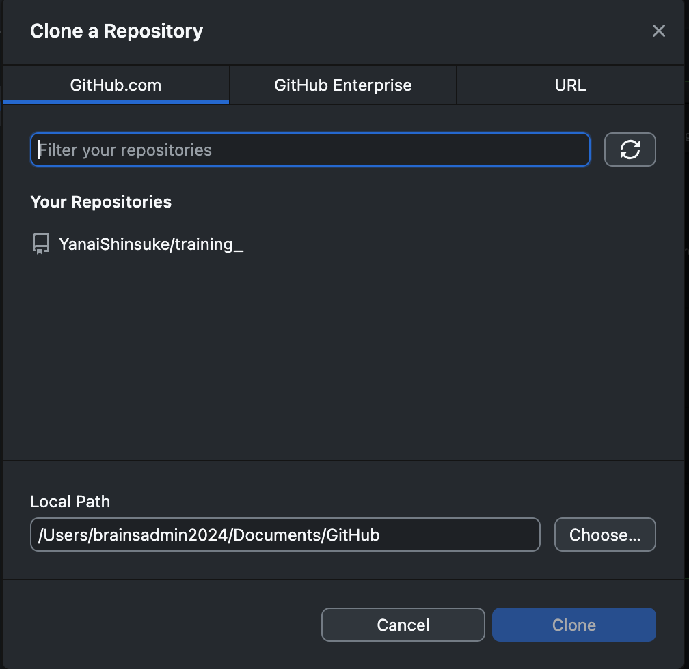
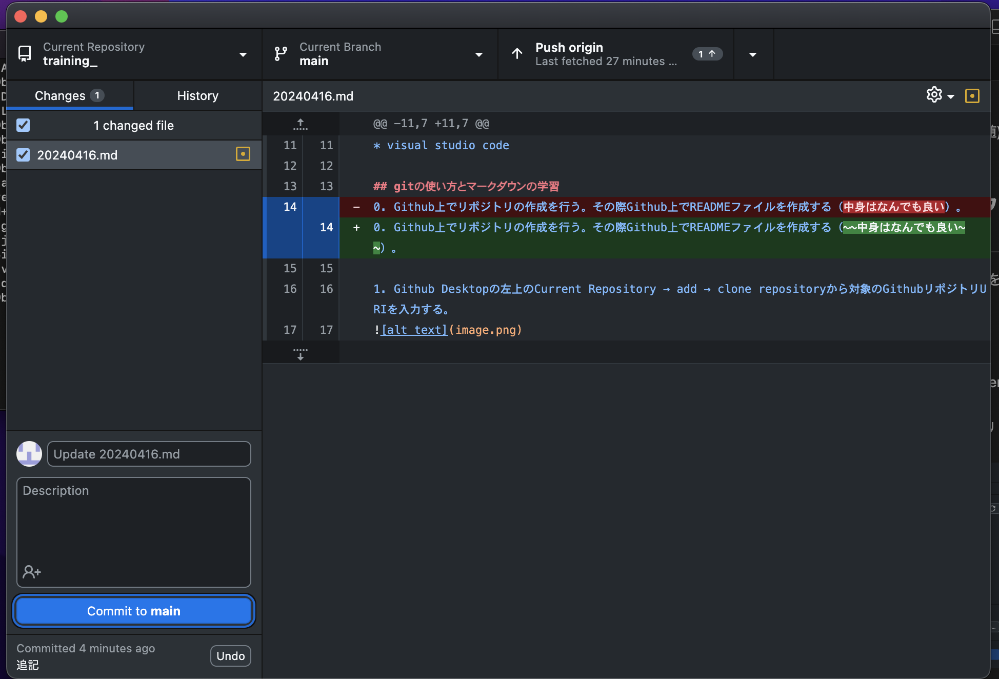

# 本日行ったこと

## mac環境構築
下記をインストール
* homebrew
* git
* github desktop
* githubのアカウントも作成（会社のメールアドレス）
* docker (Docker Desktopをインストール)
* docker-compose (Docker Desktopインストール時に付随)
* visual studio code

## gitの使い方とマークダウンの学習

### Github DesktopでのPushまでの流れ
0. Github上でリポジトリの作成を行う。その際Github上でREADMEファイルを作成する（~~中身はなんでも良い~~）。

1. Github Desktopの左上のCurrent Repository → add → clone repositoryから対象のGithubリポジトリURIを入力する。


2. 画像のlocal pathにファイルを追加する。今回は本日行った作業をまとめた20240416.mdファイルを保存した。

3. ファイルの追加や変更点があった場合、下記の画像左下に、タイトルとコメントを書いてCommitする。


4. Push Origin(基本はOriginですが、名称は人によります)でGithubにファイルをプッシュする。

### コマンドライン上での流れ
エラーが起きたため、解決中

#### ・問題点

ssh接続のため、公開鍵をGithub上にあげ、`ssh -T git@github.com`を実行すると、

```
Hi YanaiShinsuke! You've successfully authenticated, but GitHub does not provide shell access.
```
と出力され、SSH接続自体は実行できた。しかし、localでpushしてもパスワードを求められたため、SSH接続できてない可能性が高い。