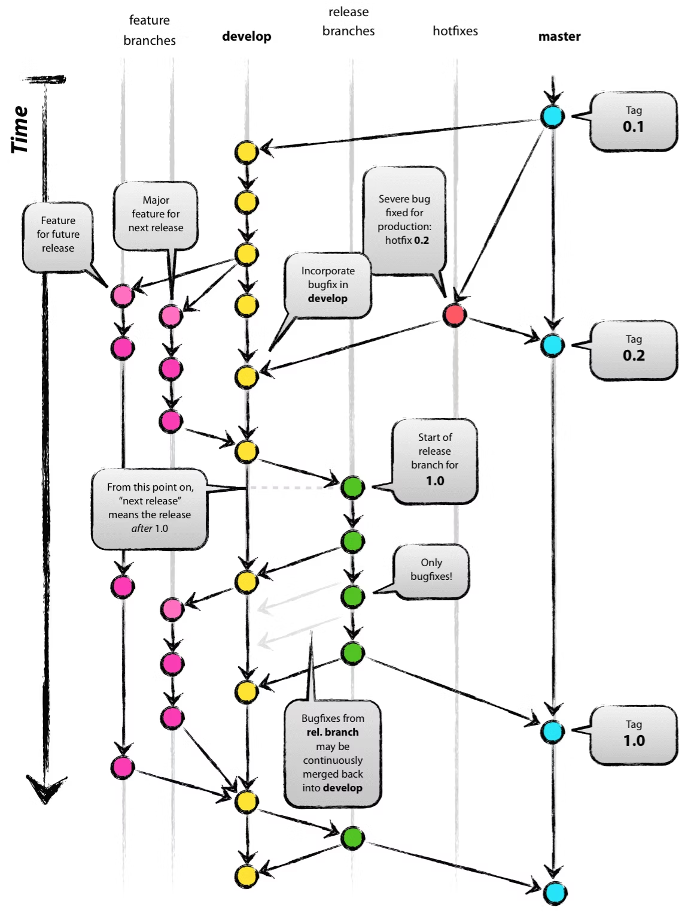

# エイリアスを使ったssh接続
ssh接続では、毎回復号鍵をオプション指定するのが大変。理想は`ssh training`のように、エイリアス名を入力するだけで研修用のインスタンスに接続したい。

## 実行コード
`~/.ssh/`配下にconfigファイルを作成し、ssh接続に必要な情報を記入する。

```~/.ssh/config
Host training
    HostName IPAdress
    User yanai
    port ssh port num
    IdentityFile  Filepath
```

実際に`ssh training`と記入すれば研修用インスタンスに接続できた。

## 補足　エイリアスとは
要はあだ名のこと。ショートカットのようなもの。

シンボリックリンクとの違いは、エイリアスではエイリアスレコードと呼ばれるファイル固有の情報を保持しているため、ファイルパスが変わっても、名前が変わってもリンクは切れない。

UNIX系でエイリアスといえば、コマンドを別名で登録する機能を指す。

エイリアスはメールアドレスでも使える。例えば`会社名.co.jp`のように会社メンバーのメールアドレスをエイリアス化することで、メール送信の手間が省ける。

# Git、GitHubとは
## Git
Gitはバージョン管理ツールの一つ。従来は変更点があるたびにバックアップして保存を繰り返していたが、Gitなどのバージョン管理ツールの登場により、一貫したルールに基づいたバージョン管理が可能となった。

さらに複数人の開発も支障なくできるようになり、開発現場では必須のツール。

## GitHub
GitHubはGitのリポジトリをリモートで管理できる仕組み。GitHubにより、一つのマシンに複数人が入らなくても同時編集が可能となった。

GitHubは誰でも閲覧できるパブリックモードがあるため、様々なープンソースを誰でも閲覧、編集できる。

# Gitの使い方
```
# リポジトリの作成
cd ~/test
git init

# ファイルの作成
touch test

# git commit
git add .
git commit -m test

# commitの確認
git log

# 変更加え、コミット
echo "Hello" > test
git commit -a -m 内容追加

# 直前のコミットを取り消し
git reset --soft HEAD^

# 直前のコミットを上書き(コメント欄の編集)
git commit --amend
```

# ブランチ操作に慣れる
```
# ブランチ作成
% git branch update
% git branch

* main
  update

# ブランチ移動
git checkout update

# ファイル編集してcommit
vim test
git commit -a -m 追記
% git status

On branch update
nothing to commit, working tree clean

# ブランチをmerge
git checkout main
git merge update

# conflictしたときの対処法
1. git mergeを強行して、必要なものだけ残す
2. git reset --hard HEAD^を実行していき、コンフリクトが起きないレベルまで遡る。 
```

# GitHub操作
folk, fetch, pullリクエストの理解。

# GitFlow

[参考リンク](https://qiita.com/KosukeSone/items/514dd24828b485c69a05)


|ブランチ名|役割|
|----|----|
|master(main)|ブロダクトとしてリリースするためのブランチ|
|develop|開発ブランチ。コードが安定したらmasterにmerge|
|feature branch|機能の追加。developから分岐し、developにmerge|
|hotfixes|リリース後のクリティカルなバグ修正。masterから分岐し、masterにmergeしてタグつけ。その次Developにmerge|
|release branches|プロダクトリリースのためのブランチ。Developから分岐し、リリース時にmasterにmergeしタグつけ。その後Developにmerge|

masterとdevelopでは作業を行わず、基本はfeature, hotfixes, releaseで作業を行う。

### メリット
	* 本番リリースのリポジトリと開発中、修正のリポジトリを区別する。
	* 開発、修正ごとにリポジトリを作成可能。
	* リリース後の緊急対応を開発、修正と独立して対応可能。
	* 履歴により、リリース内容を後から追跡可能

 

# commitのコメント作法
一行目は５０字以内。一行あけて、三行目から詳細なコメント記述。
