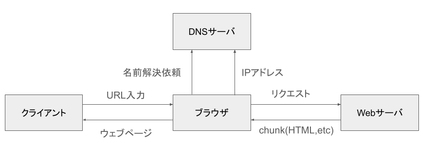
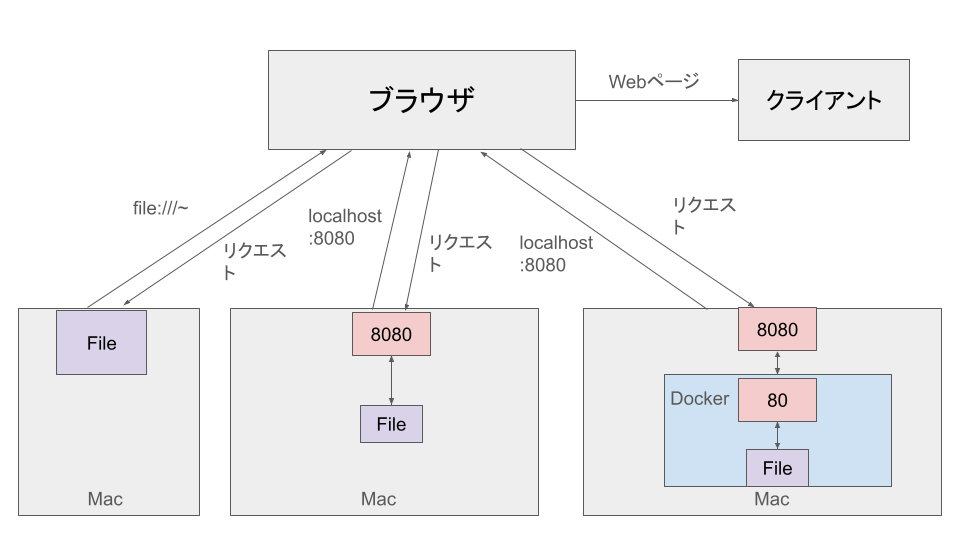

# Webページがブラウザに表示される仕組み



1. ブラウザーは DNS サーバーにアクセスし、ウェブサイトのあるサーバーの実際のアドレスを探索。
2. ブラウザーはサーバーに HTTP リクエストメッセージを送信して、ウェブサイトのコピーをクライアントに送るようリクエスト。このメッセージ、およびクライアントとサーバーの間でやりとりされるその他すべてのデータは、TCP/IP を使用してインターネット経由で送信される。
3. サーバーがクライアントのリクエストを承認すると、サーバーはクライアントに "200 OK" というメッセージを送る。そしてウェブサイトのファイルを、データパケットと呼ばれる一連の小さな塊 (chunk) としてブラウザーに送信し始めます。
4. ブラウザーはchunkを完全なウェブページに組み立て、表示する。

# mac上でHTMLファイルにアクセス

# mac上にnginxを導入し、サイトを閲覧できるようにする。
```
# nginxをインストール
brew install nginx

# 
```

# macにdockerを使用しnginxを導入し、サイトを閲覧できるようにする。
Dockerを使用し、Macにnginxサーバーをたて、localhostで自身のIPアドレスを指定してWebページにアクセス。

```
# nginxを立ち上げる
docker run -dit --name webserver -p 8080:80 nginx

# Webサーバにhtmlを追加する。
docker run -dit --name webserver -p 8080:80 -v $host_Path:/usr/share/nginx/html nginx
 ```

# 3つの処理の違い


# HTMLとHTML5
HTMLはWebサイトを中身構成する、マークアップ言語の一つ。HTMLの記述によって検索エンジンがWebサイトの構造を把握しやすくなる。その理由として、タグや要素、属性を記述しているから。

HTMLは複数のバージョンがあり、その最新が**HTML5**。一般に使われているHTML4.1と比べ、使えるタグがかなり増えている。

## HTMLタグ
|タグ名|機能|
|----|----|
|section|コンテンツの一つのまとまりを示す|
|header|ヘッダーコンテンツ（ヘッダー画像など）|
|footer|フッターコンテンツ（コピーライトなど）|
|nav|他のWebページへのリンクやページ内リンク|
|article|文章の内容が独立したセクション。入れ子構造も可能|
|canvas|図形を書く際に使用するタグ。描写はJavaScript。|

# ホームページにphpファイルを追加して、フォームに必要事項を入力した際、`405 Not Allowed`と出力され、正常な動作が行われなかった。対策をここに記す。

## phpの挙動
phpはサーバー側でコードが実行される。リクエストが来て、Webサーバでphp処理が行われ、処理された結果のhtmlファイルをレスポンスする。
そのため何か処理を行う際、リロードしないと結果を表示できない。
